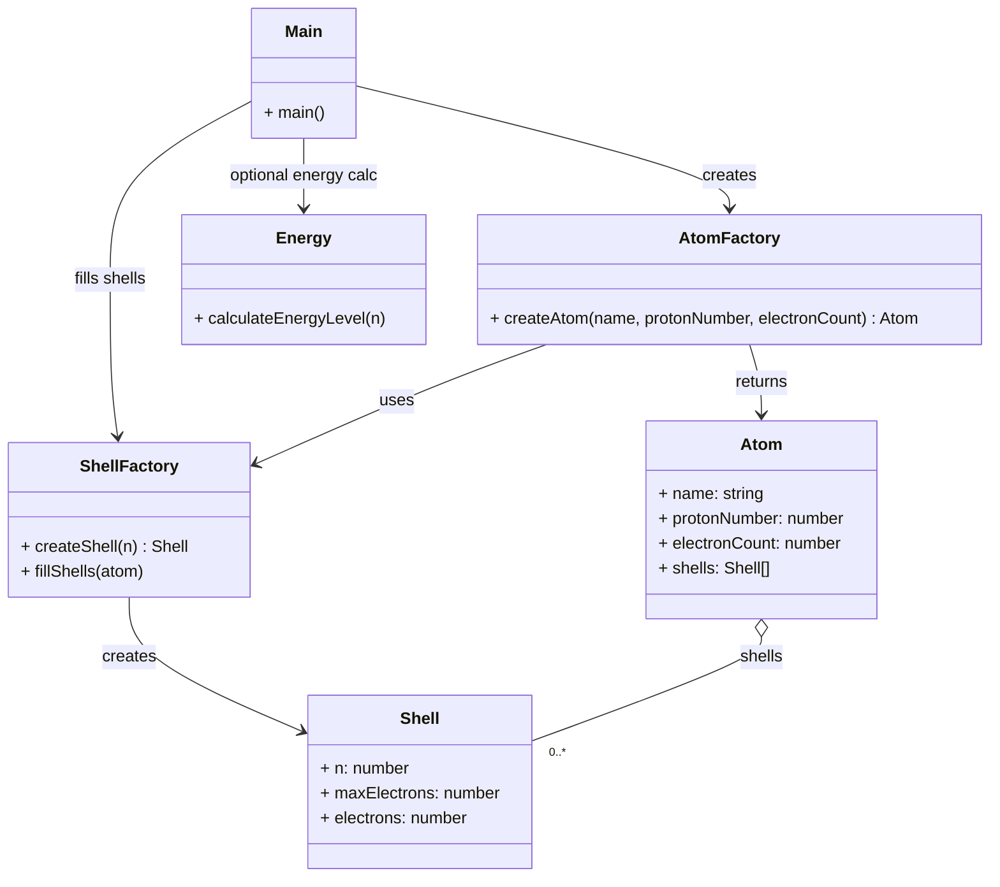

# Schalenmodell - Architektur in JS

```yaml 
main.js 
│ 
├── physics/ 
│     ├── atom.js 
│     ├── shell.js 
│     └── energy.js 
│ 
├── render/ 
│     └── renderer.js 
│ 
└── state.js
``` 

## Mermaid-Diagramm




---

**Author** : kuranez